# Ejercicio 1 - Creación de la aplicación y la configuración inicial del tema

¡Bienvenido! Al acceder al lobby de SAP Build, tiene acceso a todas las herramientas para crear aplicaciones de bajo código.

> #### Alcance inicial de nuestra aplicación.
> - Lista de productos, proveniente de un servicio Odata llamado Northwind. Esta lista contendrá icono, título y precio.
> - Mecanismo de búsqueda a través de la exploración de código QR.
> - Detalles del producto en una página secundaria.

Comencemos nuestro proceso de desarrollo haciendo clic en el botón __Create__.

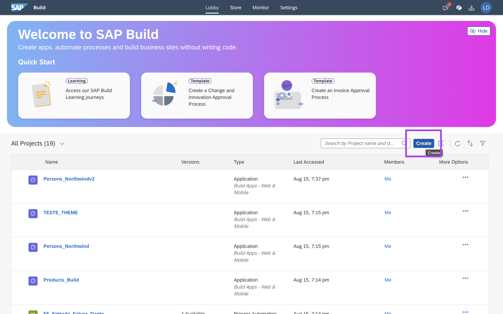

En esta pantalla podemos seleccionar qué tipo de aplicación construiremos.
Seleccionar __Build an Application__.

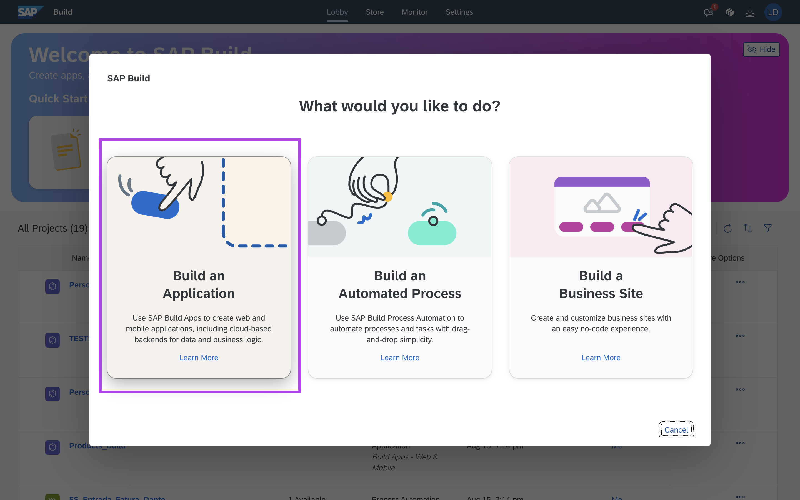

Dentro de SAP Build Apps podemos ensamblar, __Web & Mobile Application__, Herramienta para construir una aplicación front-end desarrollada en un código bajo; __Application Backend__ herramienta para construir "servidores simulados", entidades de construcción; Y el __Pro Developers__ Eso crea un proyecto Fiori en el método tradicional.

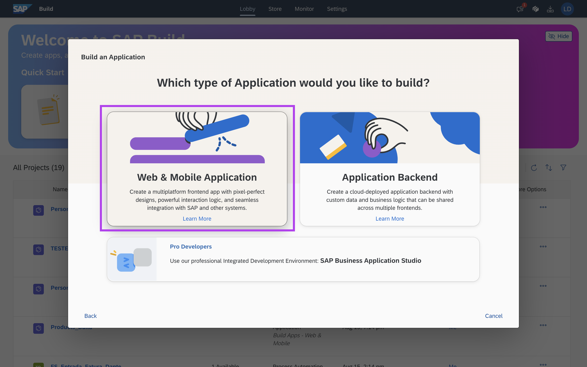

Daremos un nombre y descripción al proyecto
```
HandsOn_ProductList_[Nombre]
```

Seguiremos con el botón __Create__.

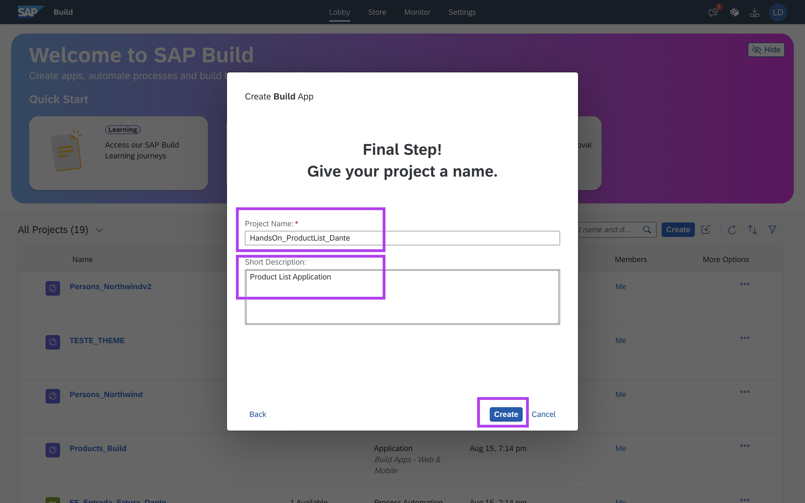

Espere la creación del proyecto.

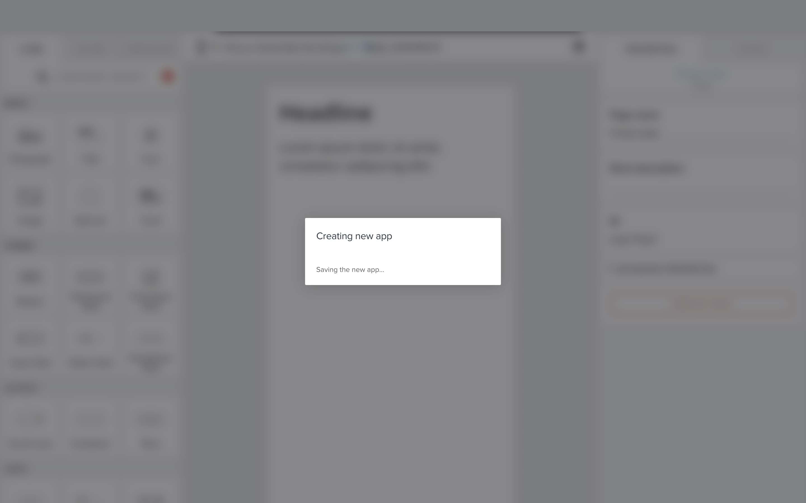

Realizaremos la personalización del tema, para que su aplicación sea una única estilización.

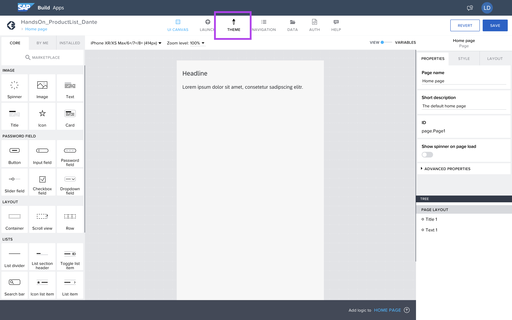

En la esquina inferior izquierda podemos hacer el cambio del tema, desde Fiori 1.7 hasta el tema universal.

El tema cuesta toda la aplicación con estándares de color y fuente.

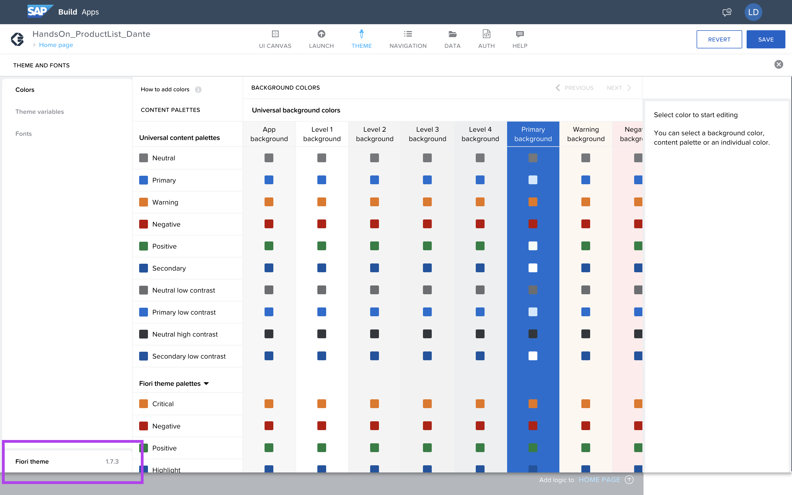

Selecione Universal Theme.
Seleccione el tema universal.

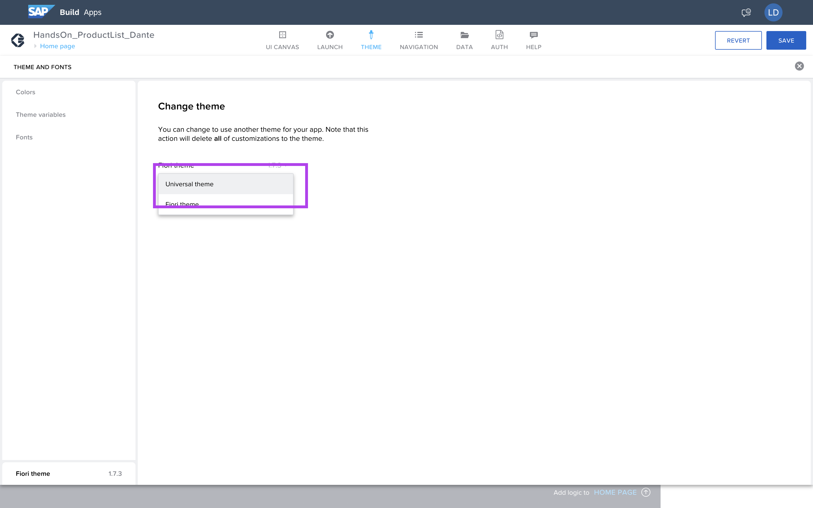

Y acepta el cambio del tema.

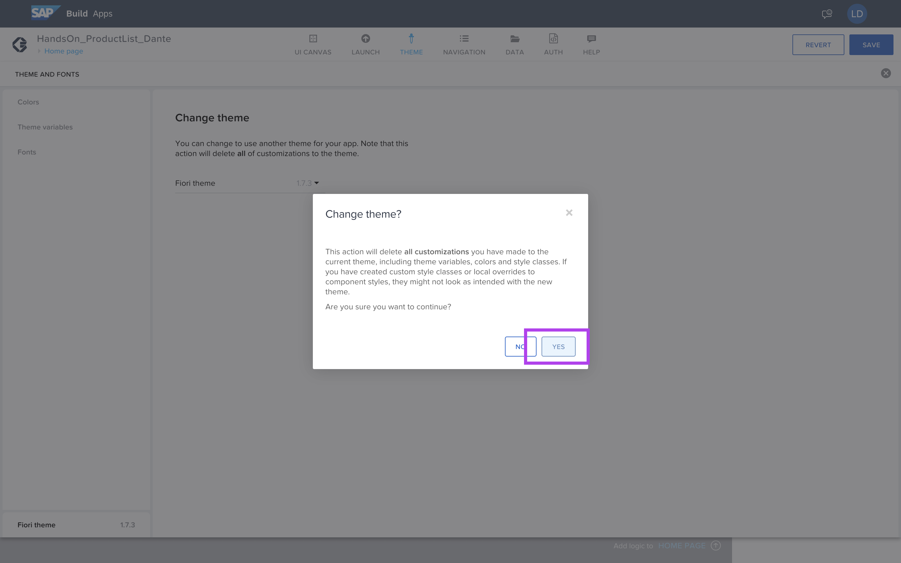

Aproveche la oportunidad para seleccionar sus colores favoritos para dejar su camino. 

Eso hizo guardar los cambios.

Clickea en__Save__.

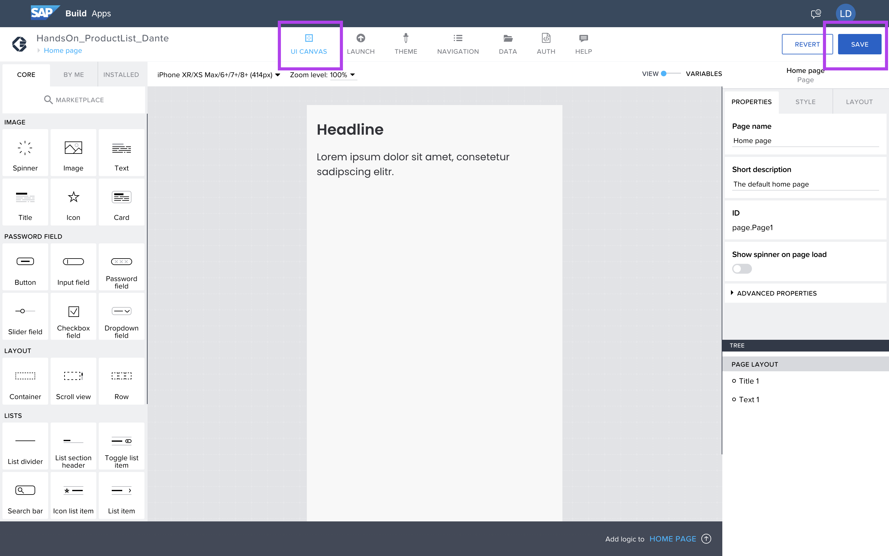
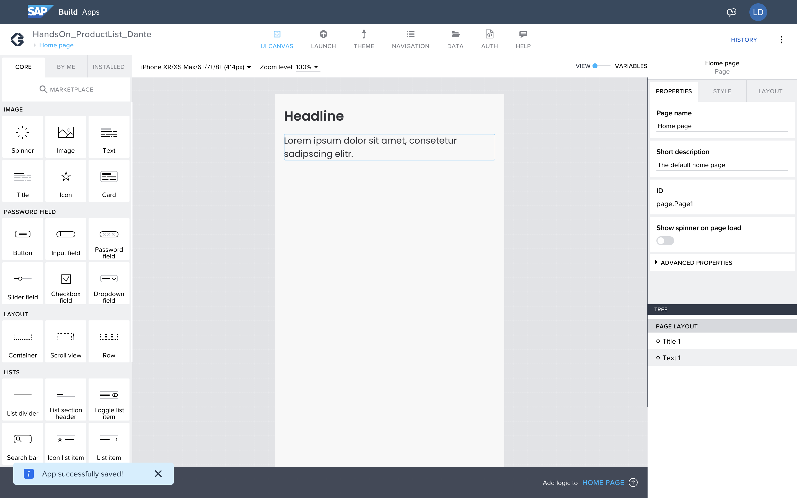


## Proximo paso:
[Ejercicio 02 - Configuración del proveedor de datos](/exercises/ex2/README.md)
