# Ejercicio 2 - Configuración del proveedor de datos

Ahora integremos con nuestro backend.

Navegue a la pestaña __Data__.

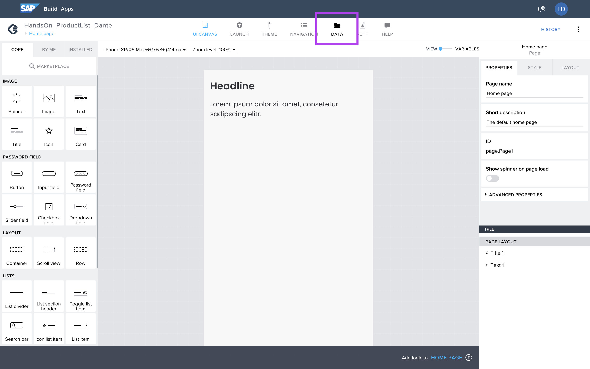

En esta pestaña tenemos muchas opciones de integración.
Estar integrado con SAP S/4, también utilizando el Conectivity > Destination.

En nuestro escenario usaremos __OData Integration__.

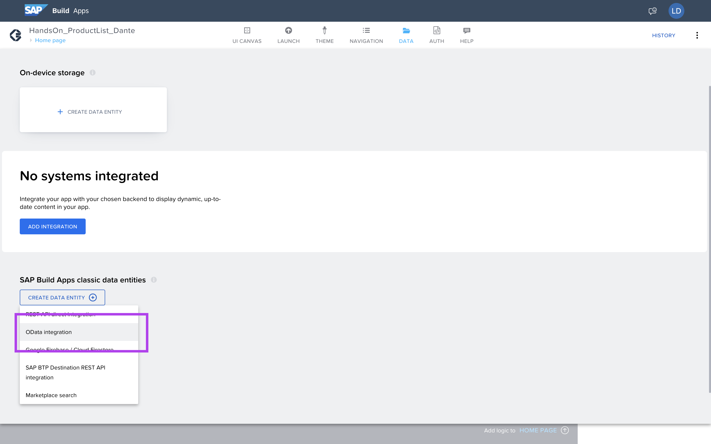

Estos son los metadatos de nuestro backend

https://services.odata.org/V3/OData/OData.svc/

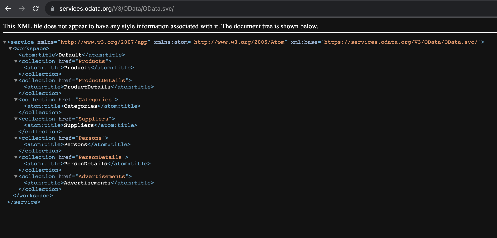

Cole o endpoint sem campo "Base API URL", y hacer clic __Verify URL__, para llevar las entidades actuales de los metadatos.

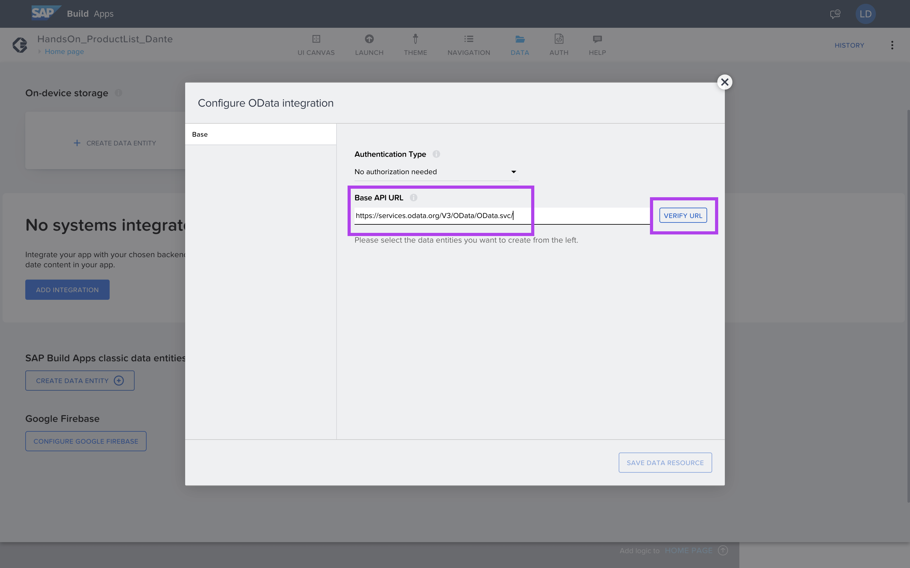

Seleccione la entidad de productos.

Y guardar, hacer clic en __SAVE DATA RESOURCES__.

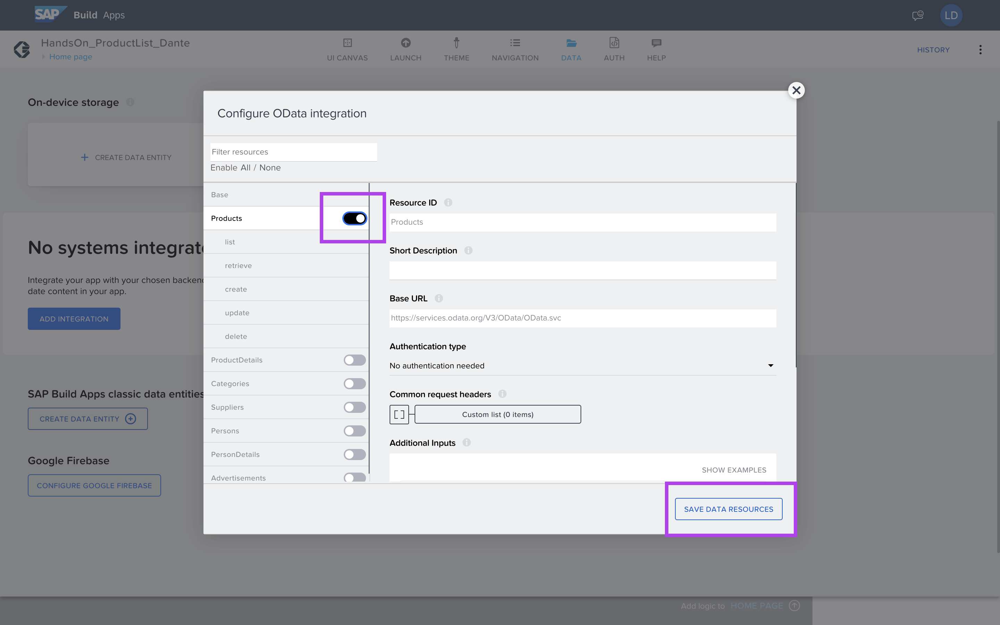

Ahora tenemos la entidad __Products__ disponible.

Clickea en __Save__.

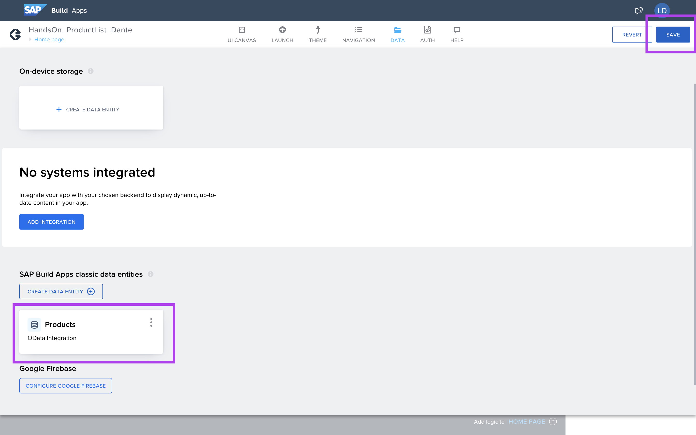

Con el __Data__ Ya configurado, tenemos que agregar a nuestra página, volver a Canvas, haciendo clic en __UI Canvas__.

Para acceder a las variables, podemos hacer clic en el Switch Button y acceder a las variables en la página.

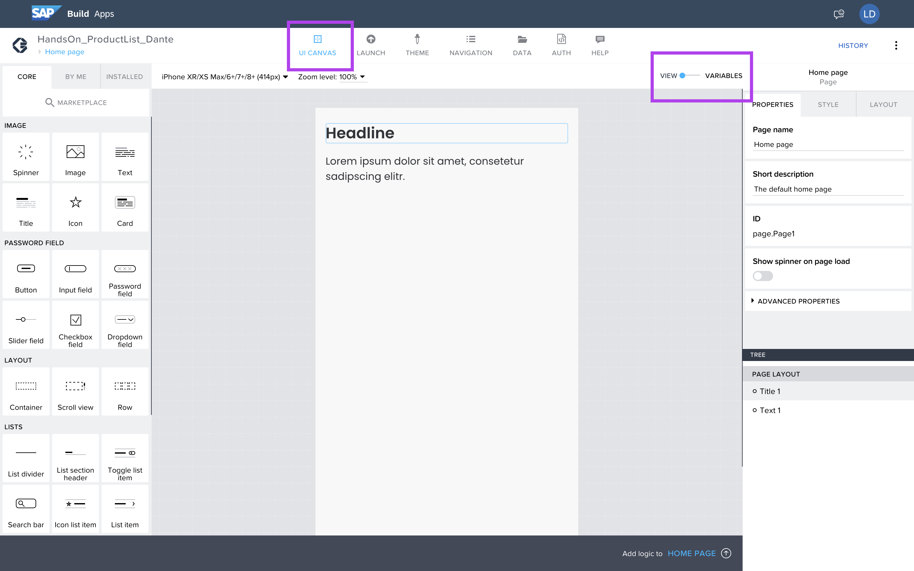

En la pestaña Data Variables, haga clic en __ADD DATA VARIABLES__.

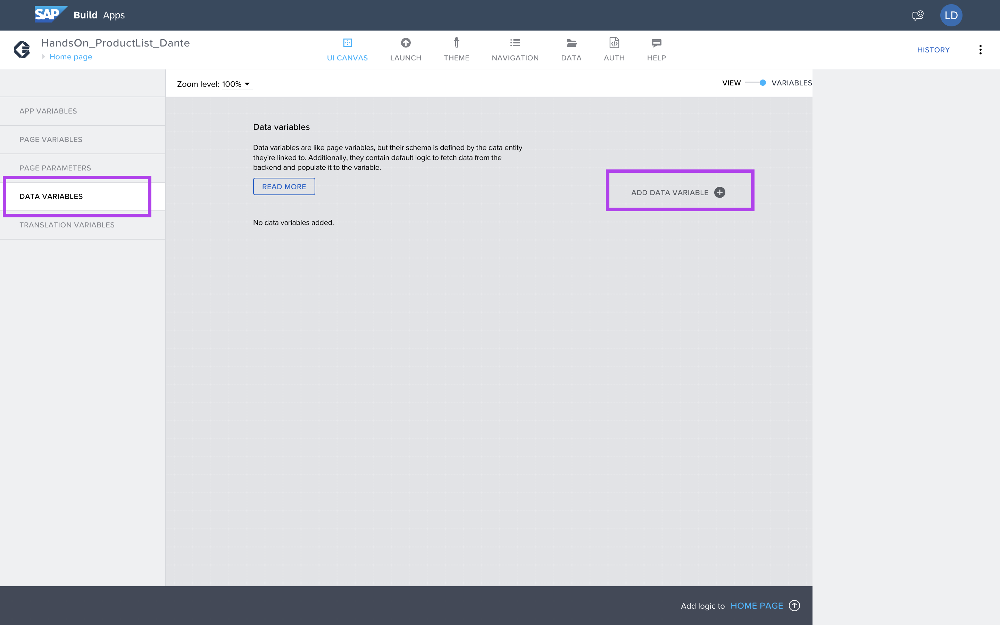

Y seleccione la entidad de productos.

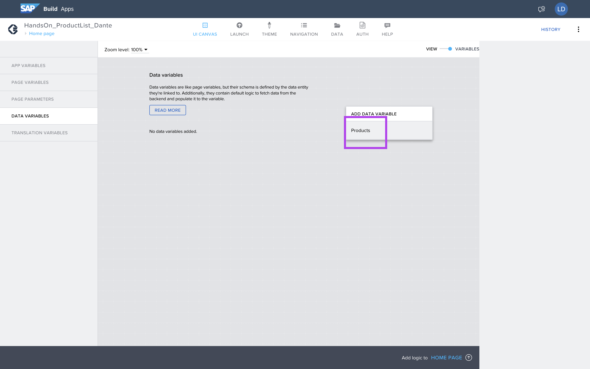

Rebautizar
```
dv_products
```

Y guardar, hacer clic en __SAVE__.

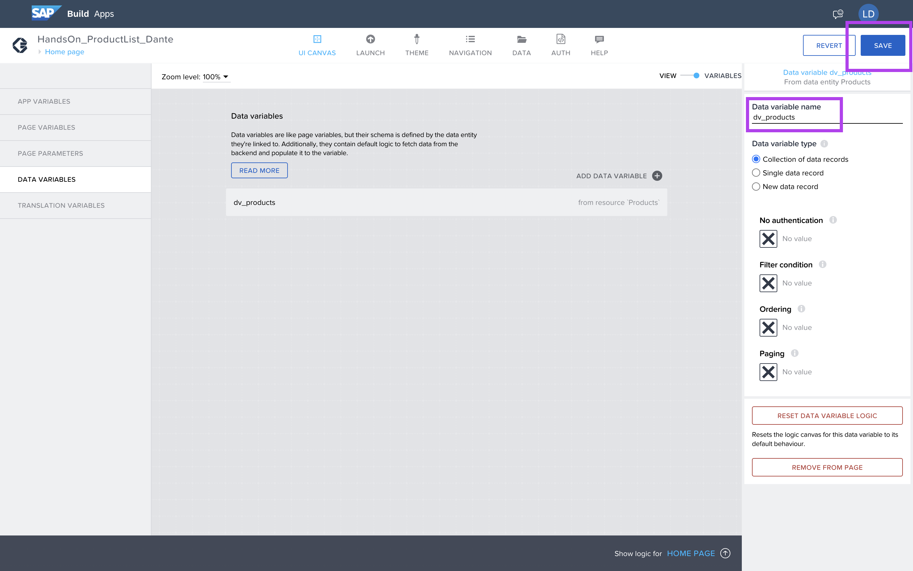

Vuelva al formato gráfico haciendo clic nuevamente en el Switch Button.

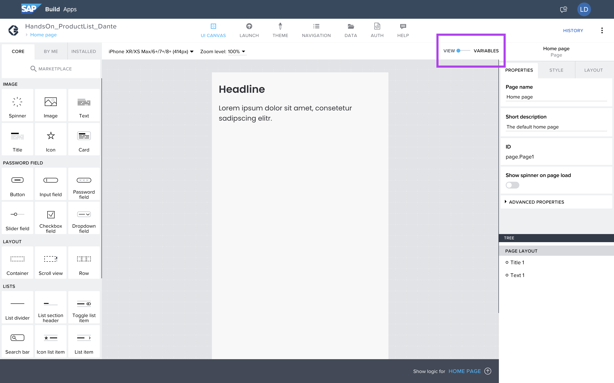

## Proximo paso:

[Ejercicio 03 - Creación de la página de inicio](/exercises/ex3/README.md)

