# Ejercicio 04 - Navegación entre la página de inicio y la página de detalles del producto

En este paso, construiremos la navegación entre la página de inicio y los detalles, donde contendrá los datos del producto en detalle.

En la esquina superior izquierda, haga clic __Home Page__, Para acceder al resumen de todas las páginas.

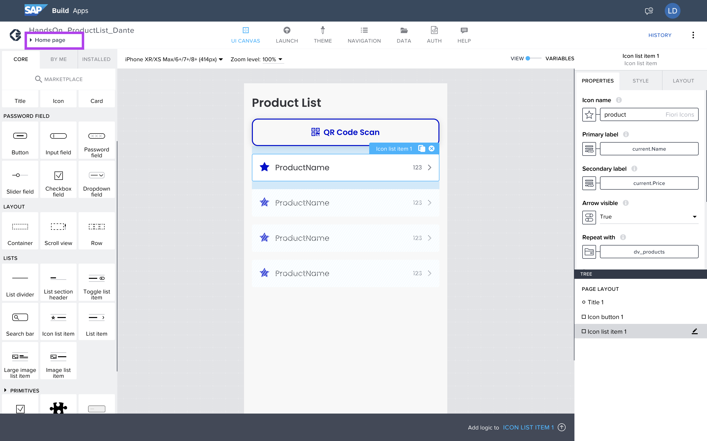

Agregue una nueva página, haga clic en __ADD NEW PAGE__.

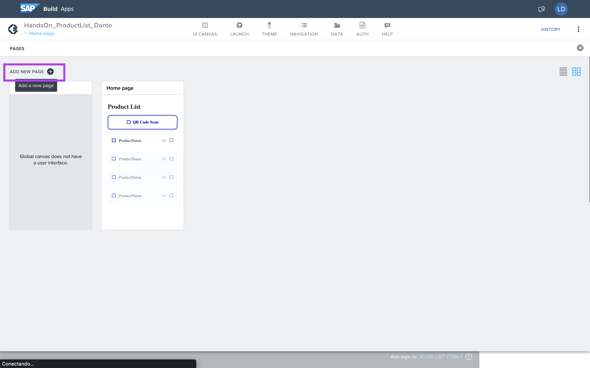

Nombre como Product Detal.
Clickea en __OK__.

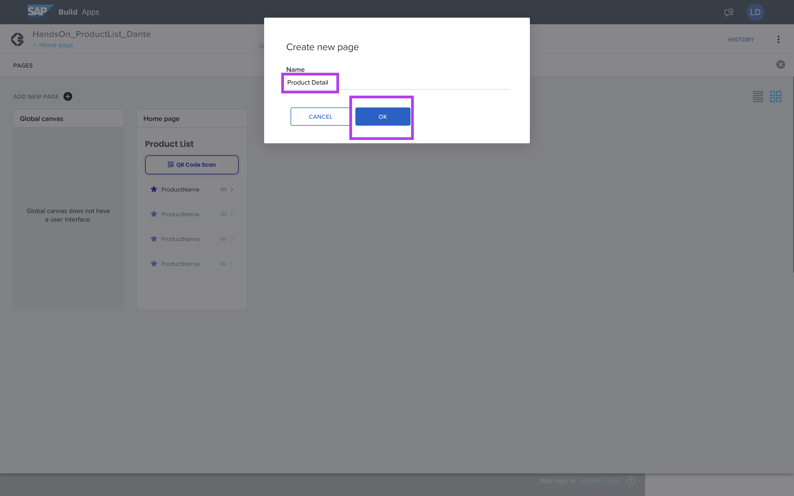

Con la nueva página creada, vaya a las variantes para configurar el PAGE PARAMETERS.

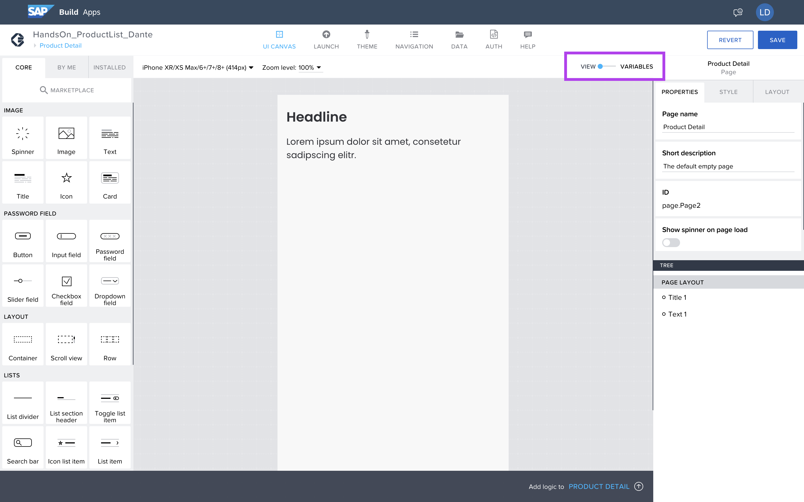

En el menú del lado izquierdo, seleccione __PAGE PARAMETERS__.

Clique __ADD PARAMETERS__.

Configure el nombre del parámetro como:
```idproduct```

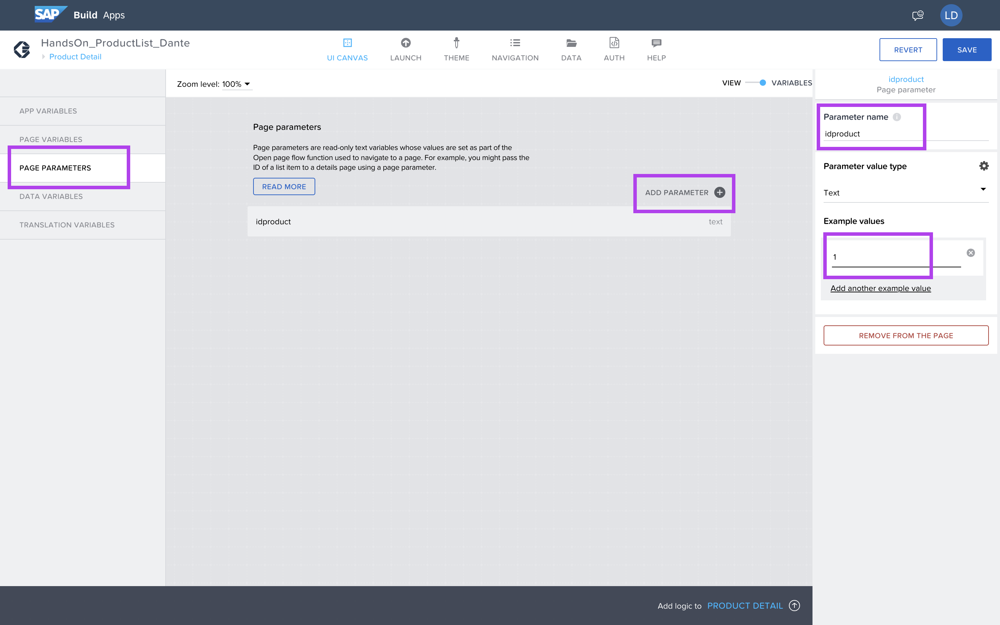

Vuelva al editor gráfico haciendo clic en el Switch Button.

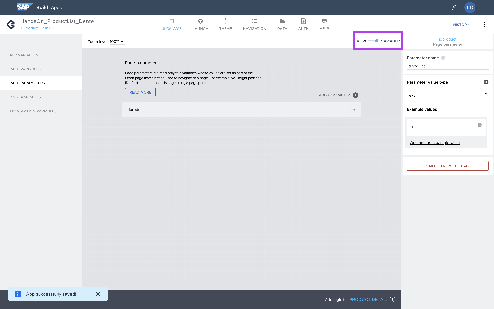

Acceda al menú de navegación haciendo clic en la esquina superior izquierda, en la etiqueta azul.

Y navegue a la página de inicio, para agregar la lógica de navegación.

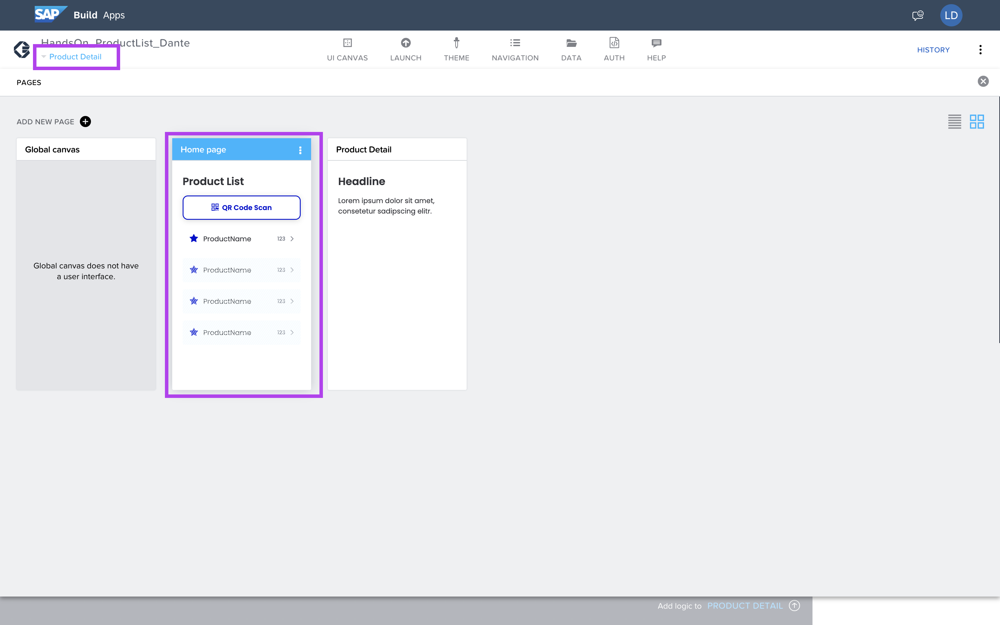

Seleccione la lista de productos para agregar lógica.

Clickea en: __Add logic to ICON LIST ITEM 1__.

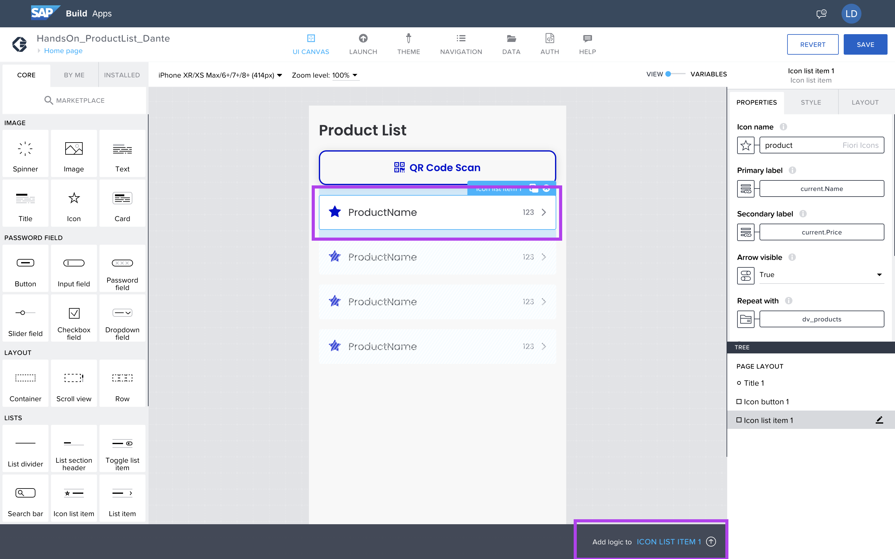

En los elementos de la lógica, agregue:__Open page__.

Y conecte el evento a la navegación.

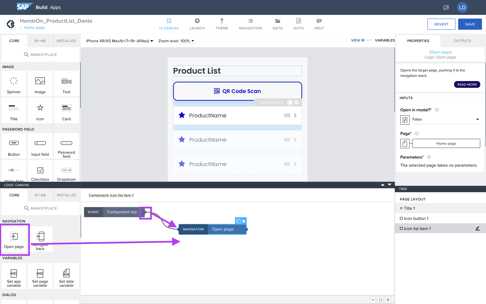

Seleccione la página que se abrirá por:__Page__.

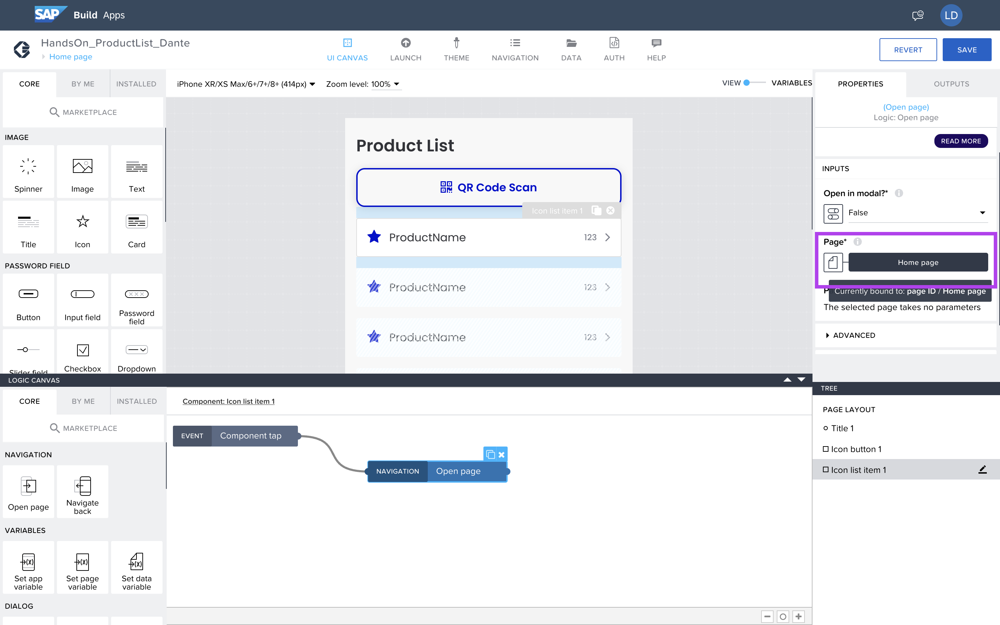

Seleccione la página __Product Detail__ e __Save__.

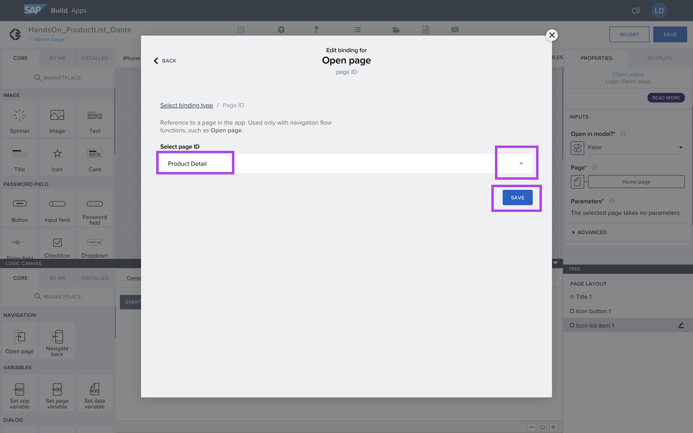

Habilitará un campo: __idproduct__.

Seleccione qué elemento se aplicará como valor.

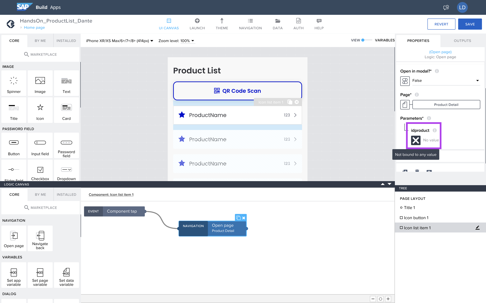

Seleccione __Formula__.

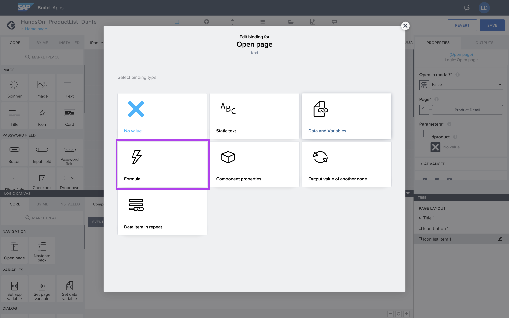

Seleccione __Create formula__.

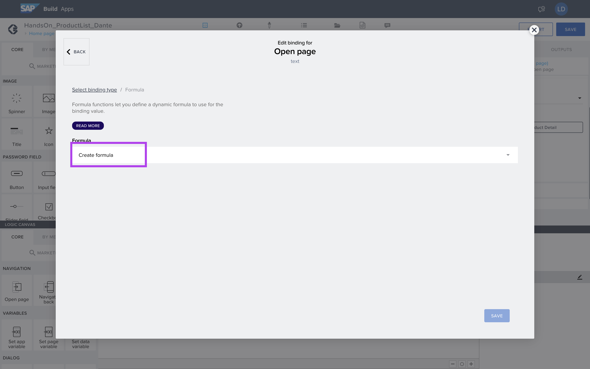

Complete el campo:

STRING(repeated.current.ID)

Y guardar la fórmula.

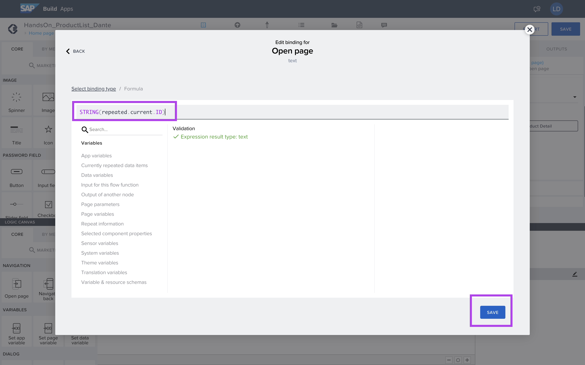

## Proximo paso:
[Ejercicio 05 - Creación de la página de detalles del producto](/exercises/ex5/README.md)