# Ejercicio 6 - Creación de la funcionalidad de búsqueda de código QR

En este paso, agregaremos la funcionalidad de buscar un producto por código QR utilizando la cámara del dispositivo.

Para esto, utilizaremos un acelerador de SAP Build que nos axilará en este desafío.

En la esquina superior izquierda, haga clic en el menú de navegación.

Y seleccione la página de inicio.

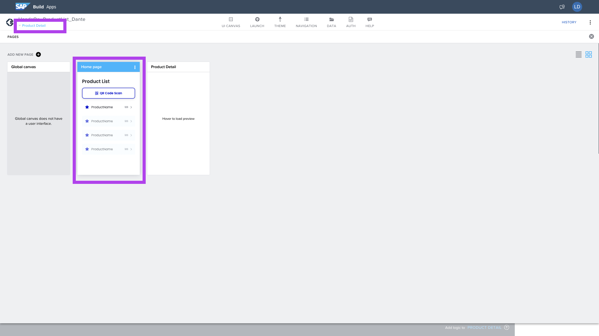

Seleccione el botón de escaneo de código QR, ya que es que agregaremos nuestra lógica.

Y haga clic en: __Add logic to ICON BUTTON 1__.

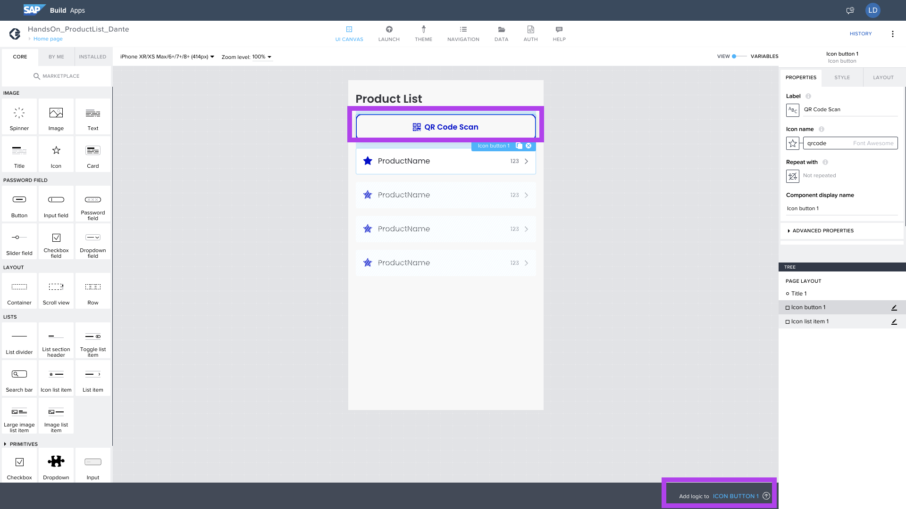

Tenga en cuenta que en nuestro menú del lado izquierdo también tenemos nuestra tienda.

Procure por: __Scan QR__, y agregar al tablero.

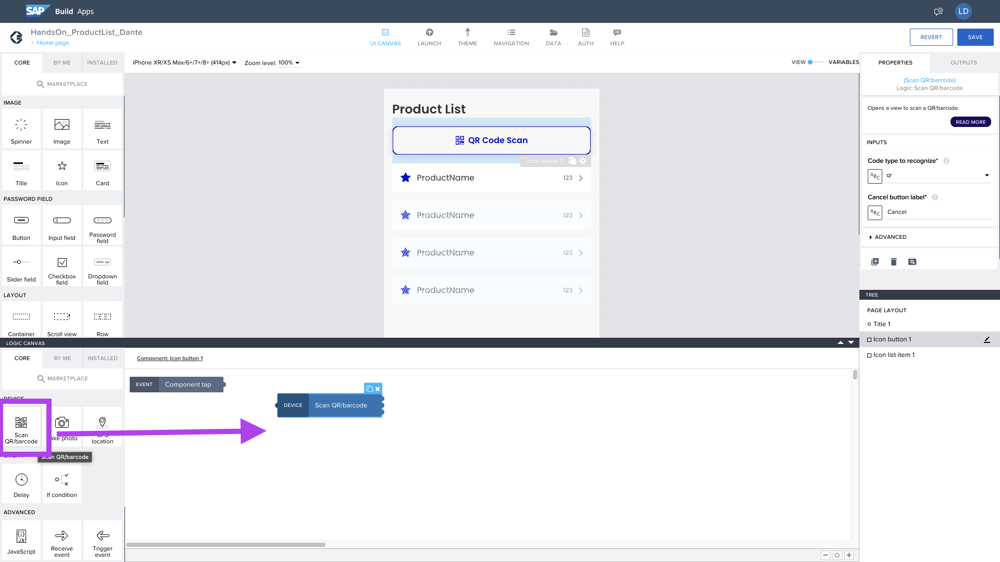

También agregar __Open Page__, Porque tan pronto como leemos la identificación del producto, necesitamos navegar a la página de detalles.

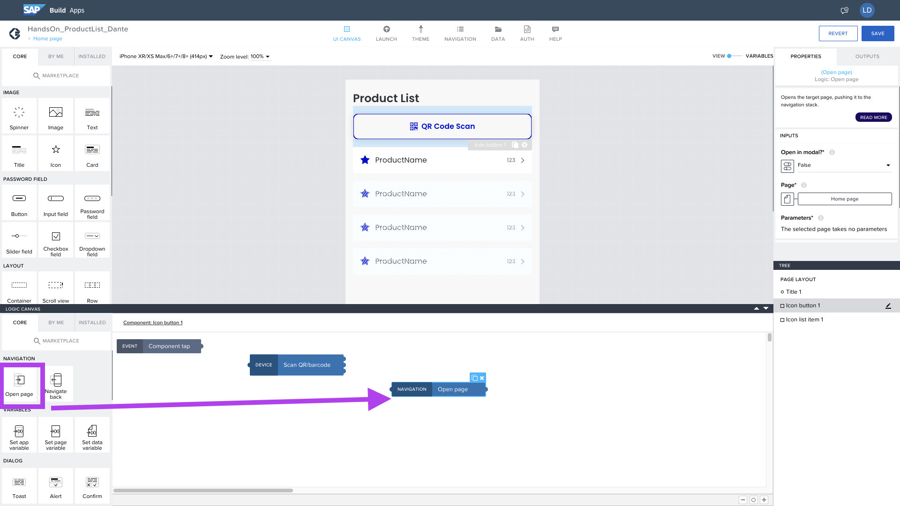

Interconectar los Nodes para que tenga un flujo.

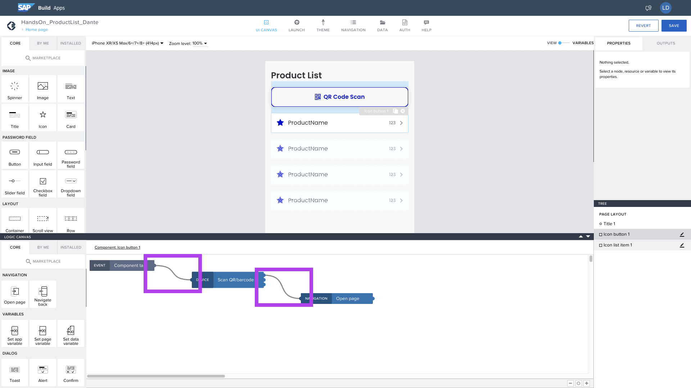

Seleccione el Node del OpenPage y cambiemos la página de apertura.

En la esquina derecha, seleccione __Page__.

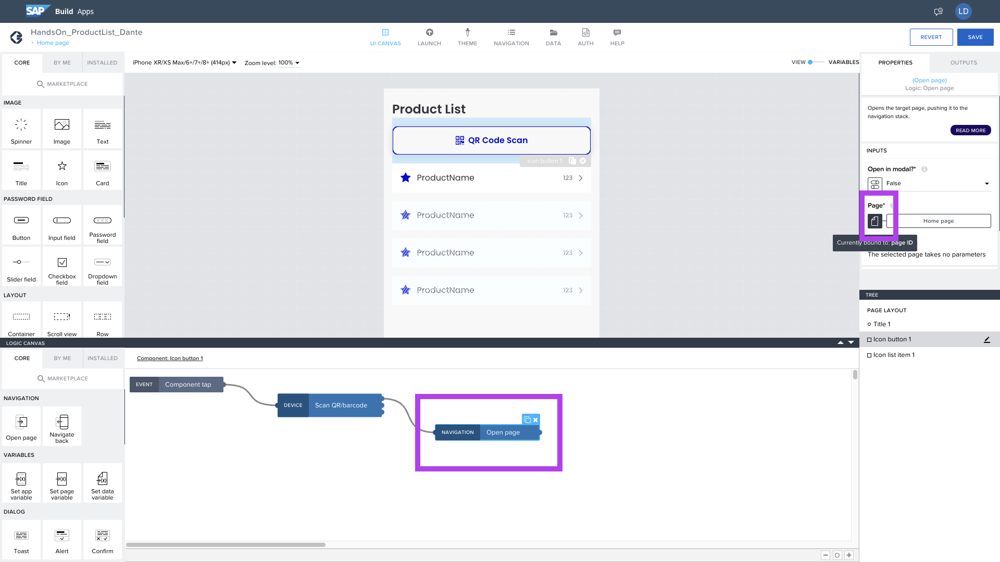

Seleccione __Page ID__.

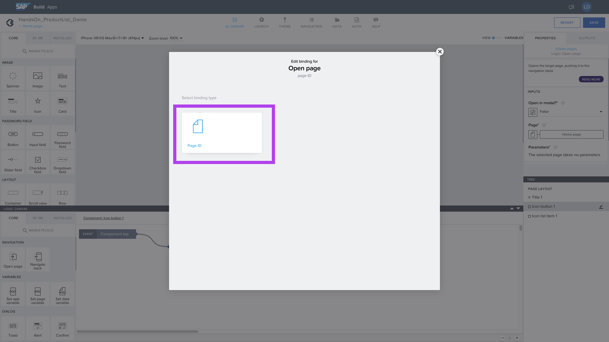

Seleccione el detalle del producto y __Save__.
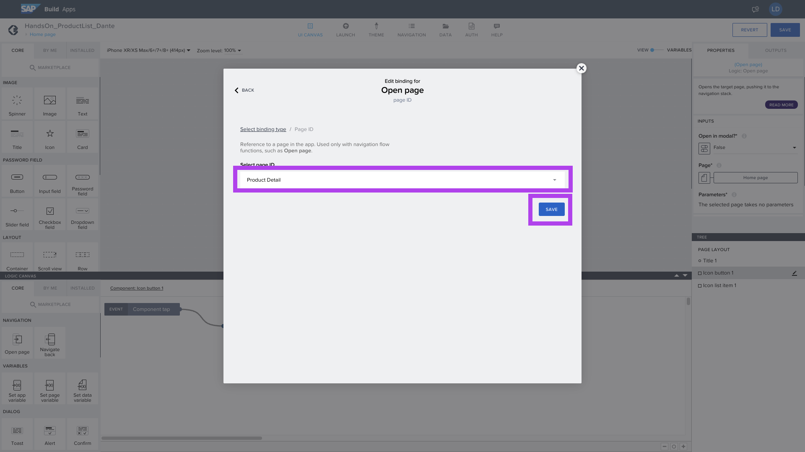

Ahora seleccionaremos lo que contendrá en el __ID Product__.
Usaremos una variable de otro nodo, que será de Scan QR.

Seleccione __Output value of another node__.

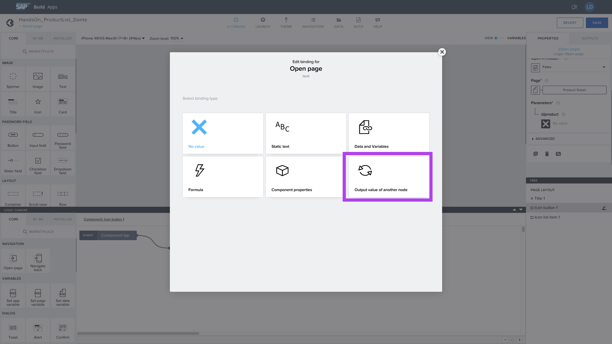

Seleccione __Scan QR/barcode__.

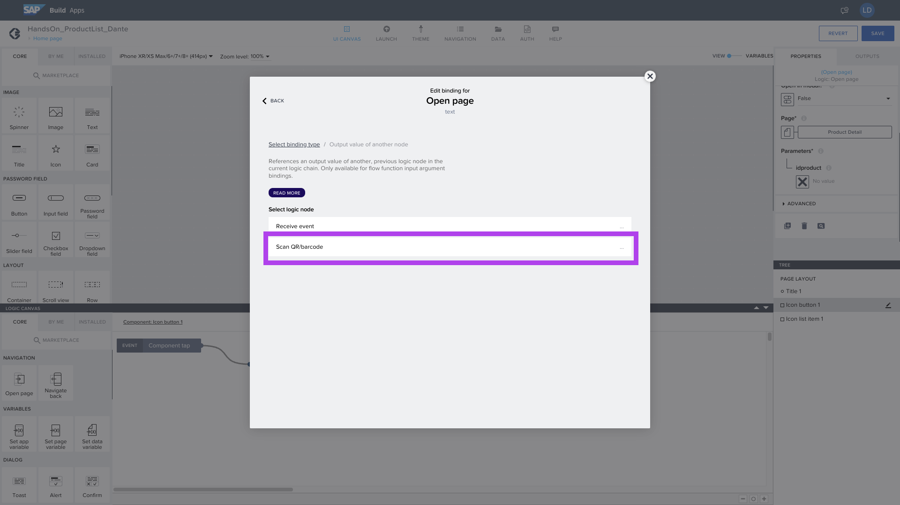

También seleccione el objeto __Scan QR/barcode content__.

E guarde.

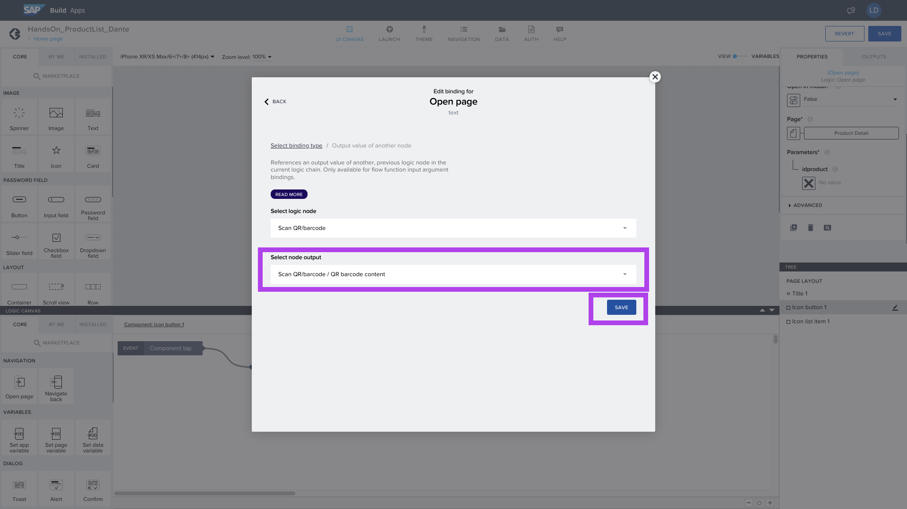

¡Listo! Ahora tenemos nuestra funcionalidad de búsqueda QR lista. Guarde su aplicación y esté listo para probar.

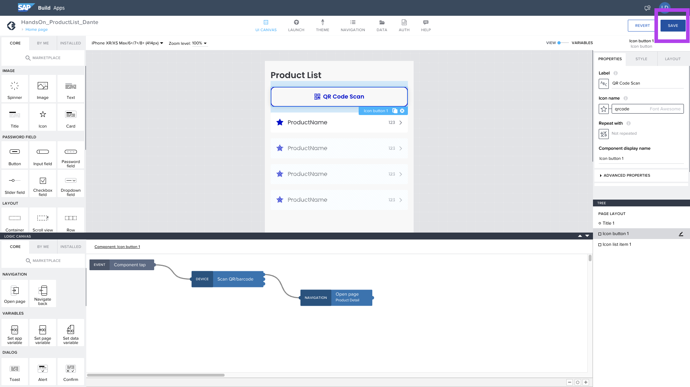

## Proximo paso:
[Ejercicio 07 - Ejecución y pruebas](/exercises/ex7/README.md)