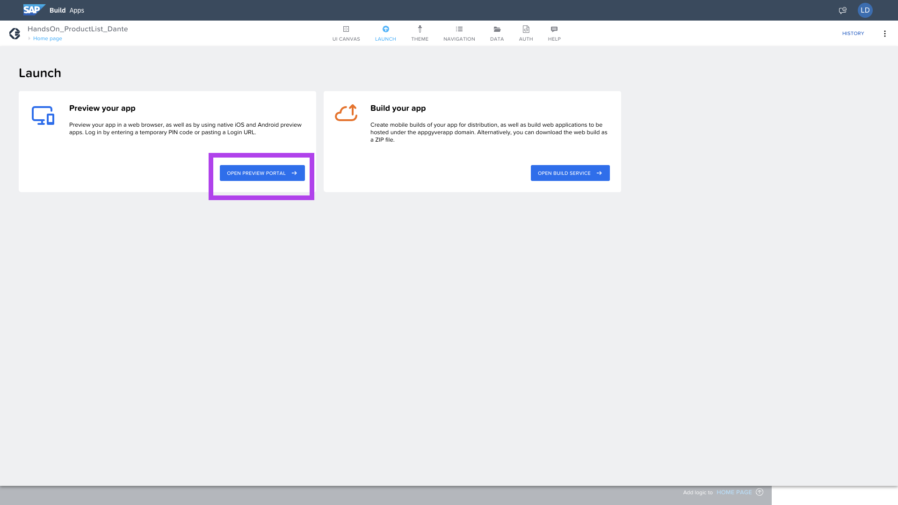
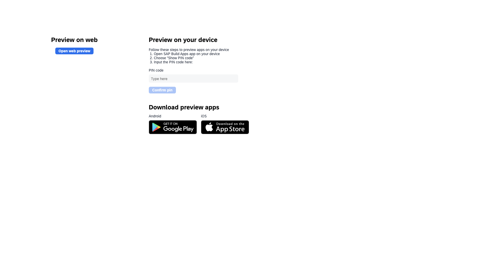
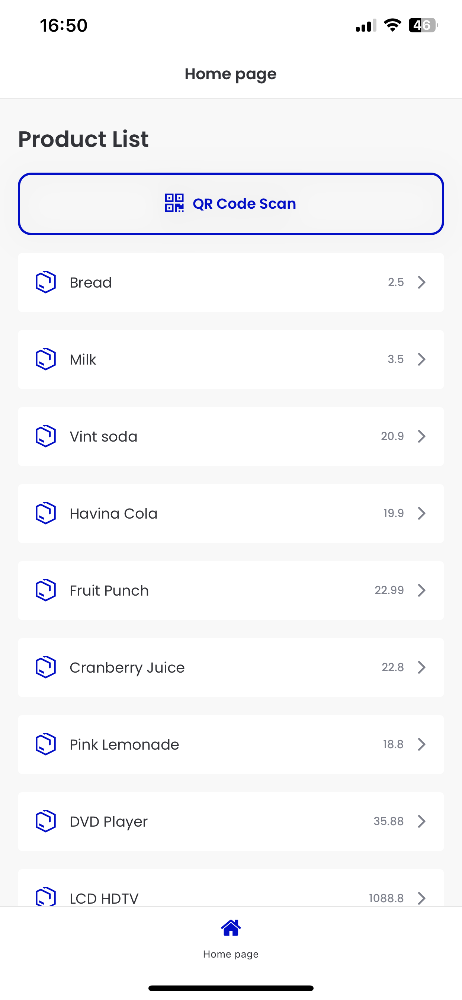
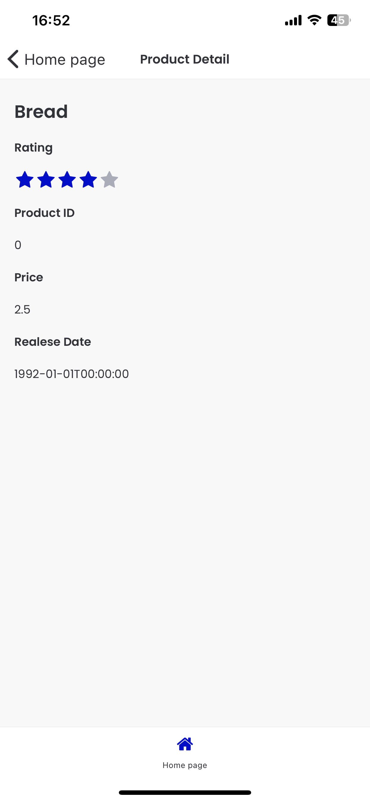

## Ejercicio 7 - Ejecución y pruebas

## Ejecución

La aplicación se puede realizar de manera web o móvil.

En el menú superior, seleccione __Launch__.

Seleccione __OPEN PREVIEW PORTAL__.

Haga el vínculo de su aplicación móvil con Vista previa.

Y su aplicación debe ser similar a esta en la vista móvil:

## Pruebas

Separé algunos ejemplos de QR para probar:
#### Producto 01.

#### Producto 03.

### Producto 10.

## ¡Felicidades! Su APP está completa.